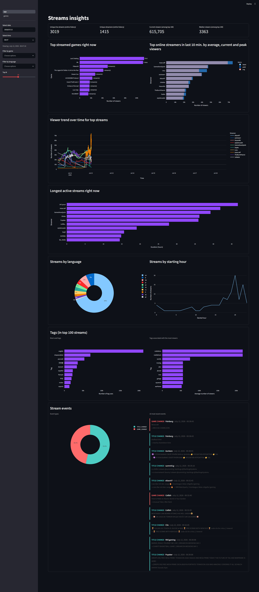
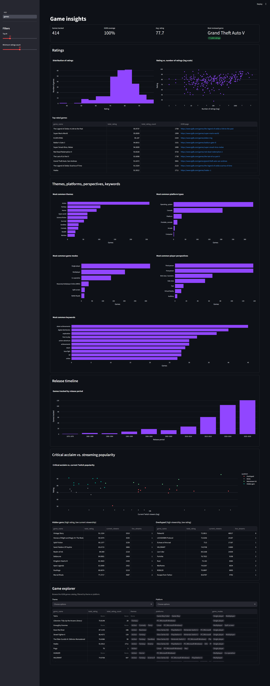
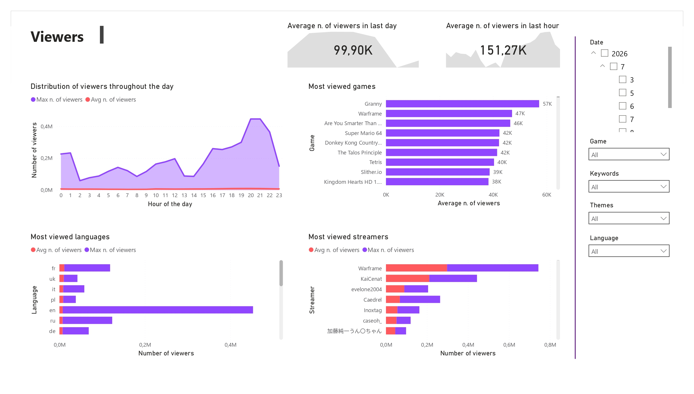
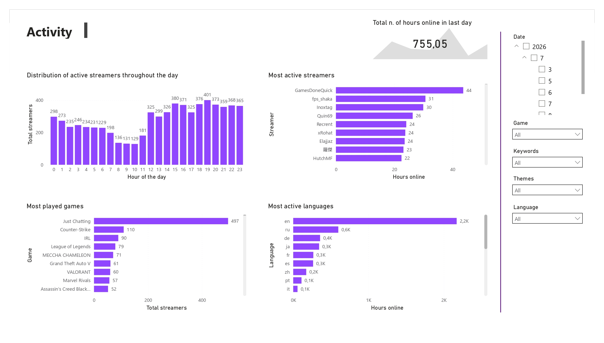
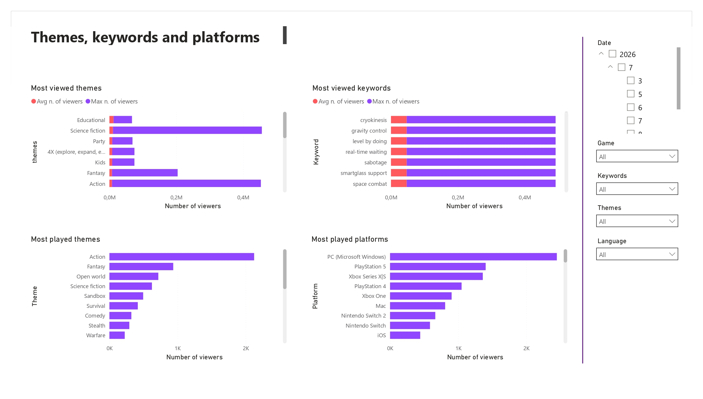
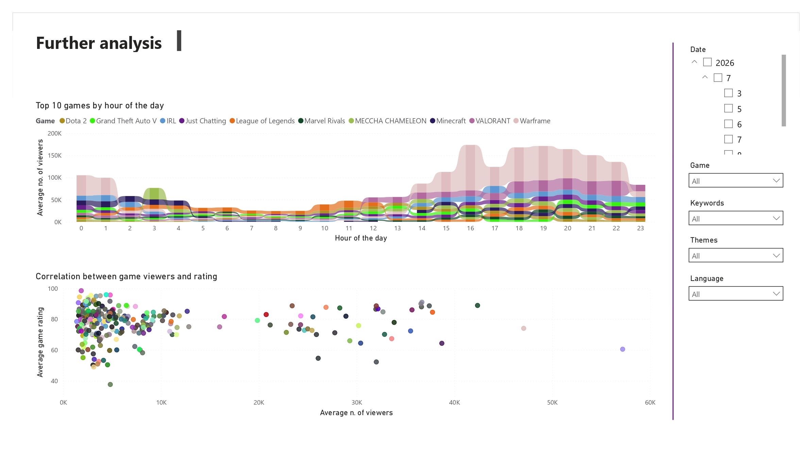

# Twitchy — Real-time Twitch analytics pipeline

<div align="left">
  <a href="https://github.com/DanielVip3/twitchy/actions"></a>
  <a href="https://github.com/astral-sh/ruff"></a>
  
  
  
</div>
<br> 

An end-to-end, real-time data engineering pipeline, built for scaling, that watches Twitch's top live streams as they happen, enriches them with game metadata from IGDB, and turns that raw feed into structured data and interesting analytics.

**HOW TO RUN:** see [Runbook](docs/runbook.md).

---

## Architecture

<div align="center">
  <a href="assets/architecture.svg" target="_blank">
    
  </a>
  <p><small>🔍 Click on the image to view full size</small></p>
</div>

---

## Dashboards
### Streamlit
Real-time dashboard connected to silver layer streams and games tables.
<details>
  <summary><strong>🖼️ Expand to see the first page</strong></summary>
  <br>
  <div align="center">
    <a href="assets/streamlit-dashboard-01.png" target="_blank">
      
    </a>
    <p><small>🔍 Click on the image to view full size</small></p>
  </div>
</details>

<details>
  <summary><strong>🖼️ Expand to see the second page</strong></summary>
  <br>
  <div align="center">
    <a href="assets/streamlit-dashboard-02.png" target="_blank">
      
    </a>
    <p><small>🔍 Click on the image to view full size</small></p>
  </div>
</details>

### Power BI
BI dashboard connected to gold layer data warehouse.

<div align="center">
  <a href="assets/powerbi-dashboard-01.png" target="_blank"></a>
  &nbsp;&nbsp;
  &nbsp;&nbsp;
  <a href="assets/powerbi-dashboard-02.png" target="_blank"></a>
  <br>
  <br>
  <a href="assets/powerbi-dashboard-03.png" target="_blank"></a>
  &nbsp;&nbsp;
  &nbsp;&nbsp;
  <a href="assets/powerbi-dashboard-04.png" target="_blank"></a>
  
  <p><small>🔍 Click on the images to view full size</small></p>
</div>

---

## 1. Overview

This is a personal project built to simulate a real-world, near real-time analytics ETL pipeline: it polls the Twitch API every minute for the top 100 live streams, grabs metadata (ratings, genres...) for every game being played from IGDB, and streams all of it through Kafka, with Avro schema enforcement, into a medallion data lake (built on S3-compatible MinIO + Delta Lake), ending up in a small ClickHouse data warehouse and two different dashboards (Streamlit and Power BI, using data at different granularities).  
Multiple continuously running Spark Structured Streaming jobs are used to transform bronze and silver layers, while Airflow orchestrates the Spark Streaming job for the gold layer hourly, schedules the API ingestion (Kafka producer) and also performs nightly optimization of Delta Lake parquet files.

The point of the project is not really "Twitch analytics" for its own sake; it is an excuse to build and operate a full streaming pipeline including orchestration, database architecture, data quality and somewhat also documentation, that could run unattended.

**What I learned:** I already had a decent amount of experience with **Spark**, **Docker** and **Power BI** going in, so this project was mostly an excuse to learn the pieces around them that I hadn't touched in a real setting before: **Kafka** for decoupled streaming ingestion, **MinIO** as an S3-compatible object store to run Delta Lake on locally, **Streamlit** for quickly slapping together an internal dashboard, **ClickHouse** as an OLAP serving layer, **Soda** as a data quality tool, etcetera. 

---

## 2. Tech stack & justification

| Tool | Used for | Why |
|---|---|---|
| **Twitch API + IGDB API** | Data sources | Twitch provides the live stream and game name; IGDB fills in the game metadata (ratings, themes, platforms, storyline...) so the game dimension is actually interesting to analyze. |
| **Apache Kafka** | Message broker between ingestion and processing | Decouples the API ingestion from the Spark job that consumes it. If Spark is down or slow, the producer doesn't care and keeps publishing; nothing is lost as it just queues up. |
| **Apache Avro** | Message schema serialization | Highly suggested by Kafka standards; I needed to enforce schema contracts between API and bronze layer to avoid ingestion of malformed data. |
| **Apache Airflow** | Data orchestration (3 DAGs) | Needed a scheduler that could run Python scripts and Spark jobs. |
| **Apache Spark (Structured Streaming, PySpark)** | Data processing | I was already familiar with Spark. I went with **Structured Streaming** specifically to react as soon as new data lands (every minute). |
| **Delta Lake on MinIO** | Bronze, silver and checkpoints storage | MinIO is a free object store fully compatible with S3, so that my code could potentially run using Amazon S3 as well. The data is stored in parquet files with Delta Lake on top, which gives ACID writes, schema enforcement, and `OPTIMIZE` compaction which matters a lot here, because a job polling every minute produces tons of small files fast. |
| **ClickHouse** | Gold layer data warehouse | Chosen because I needed a free, local data warehouse that is simple and allows for high aggregation performance. I needed an "upsert-like" behavior, not append-only, and ClickHouse allows that through its `MergeTree` engines. |
| **Terraform** | MinIO bucket provisioning | Bronze, silver and gold MinIO buckets are created declaratively with Terraform instead of a setup script, to allow for separation of concerns and not mixing infrastructure management with business logic. |
| **Streamlit + Polars + Plotly** | Interactive dashboard | Streamlit for a dashboard I could build fast without writing an entire frontend. It reads silver layer Delta tables straight off MinIO with **Polars**, which I prefer over Pandas as it is fast enough for exploration at this scale and much lighter to run locally. |
| **Power BI** | Dashboard | Power BI allowed me to create a BI dashboard on top of the gold data warehouse immediately and easily, as I was already familiar with it. |
| **Docker** & **Docker Compose** | Container orchestration | The various services needed to talk to each other reliably; I chose Compose as I already had Docker experience. I wrote custom Dockerfiles for Airflow and Spark to bake in the necessary JAR dependencies. |
| **Soda Core** | Data quality checks | Data quality checks run against silver and gold data (see the CI/CD section below). I prefer defining data quality checks in YAML over Python code as I believe they are more readable, so I chose Soda over Great Expectations. |
| **Ruff** | Linting & formatting | Opinionated, popular and very fast. |
| **Make** | Command shortcuts | Simplifying command execution to speed up development. |
| **Bash** | Scripting | Used to write automated set-up scripts for Docker init containers. |
| **GitHub Actions** | CI | Runs Ruff on every push to `main` branch. |

---

## 3. Data model & medallion strategy

Data moves through three layers, each having own bucket on MinIO. Bronze and silver are Delta Lake tables stored on MinIO, while gold has a bucket but the actual data is stored on ClickHouse:

```
twitch-bronze/    (MinIO bucket, Delta Lake, raw)
  streams/            partitioned by year, month and day
  games/              not partitioned, includes raw IGDB payload
  checkpoints/

twitch-silver/    (MinIO bucket, Delta Lake, cleaned & split)
  streams/            cleaned, enriched with derived timestamps
  stream_tags/        tags exploded into their own table
  stream_transitions/ game/title change events (stateful processing)
  games/              IGDB struct flattened into plain columns
  checkpoints/

twitch-gold/      (MinIO bucket)
  checkpoints/

clickhouse
  dim_game, dim_date, dim_streamer, dim_language, fact_stream_hourly
```

**Bronze** is the raw feed straight out of Kafka: JSON parsed with minimal processing (e.g. exploding the JSON into rows), nothing filtered or dropped, so it can be replayed from scratch if a downstream job needs rebuilding.

**Silver** is bronze cleaned up and split by purpose: the streams table gets enrichment columns (like how long a stream has been running at that snapshot), stream tags get exploded into their own table, and a stateful Spark job compares each stream's current poll against its last known state to emit `GAME_CHANGE` and `TITLE_CHANGE` events (called transitions) whenever a streamer switches category or updates their title.

**Gold** is a small star schema in ClickHouse, computed hourly from the silver streams and games tables joined together. There are five dimensions: game, date, streamer, language and hour (the last is a degenerate dimension), and a single fact table with three additive metrics: total number of viewers, maximum number of viewers, and number of polls / observations / snapshots; this fact table measures the hourly metrics of each (actively top 100) streamer.    
In ClickHouse, dimension tables use the `ReplacingMergeTree` engine to avoid duplicates when appending already existing data; the fact table uses the `SummingMergeTree` engine so identical dimension combinations across hourly batches get their measures summed automatically.

Small-file buildup from the minute-by-minute API ingestion is handled by a nightly Airflow job that runs Delta Lake's `OPTIMIZE` over bronze and silver MinIO buckets.

The full data breakdown and the star schema ER diagram are reported in the [data dictionary](docs/data_dictionary.md).

---

## 4. CI/CD & data quality

There is no deployment (the project runs locally via Docker Compose), but there are two automations in place:

- **Linting**: a GitHub Actions workflow runs `ruff check` and `ruff format --check` against every push to `main`.

- **Data quality with Soda Core**: before running the hourly gold transformation (storing data in ClickHouse), a data quality validation check is run against the **silver** layer, so that incorrect data doesn't get promoted to gold in the first place (the transformation is halted), and then also run against the **gold** layer after insertion in ClickHouse (only for verification, not halting). The checks cover missing/duplicate primary keys, valid ranges (e.g. ratings between 0–100, hours between 0–23) and referential integrity checks.

---

## 5. More details

- **[Runbook](docs/runbook.md)**: how to set-up and run the whole pipeline locally, with useful details for development and a few troubleshooting notes for the problems I ran into.
- **[Data dictionary](docs/data_dictionary.md)**: full field-by-field documentation for bronze, silver and gold data schemas, including the gold layer's star schema ER diagram.
- **[Power BI dashboard files](powerbi)**: the entire `*.pbip` project is available in the `powerbi/` directory, alongside a PDF export to show the UI without having to run the whole setup.

---

## 6. Future improvements

Improvements to add if I (had time to) keep working on this toy project:

- **Unit tests for the Spark jobs**: proper unit tests with small mock DataFrames to check the transformation logic itself (the transitions stateful transformation especially deserves this).
- **Move to Kubernetes**: Docker Compose worked fine, but does not reflect how this would actually run in production. Porting the Spark/Kafka/Airflow stack to Kubernetes would be a good next step to properly manage resources (I had a few headaches when managing CPU and RAM here as services are resource-hungry).
- **Add incident response to the runbook**: the current troubleshooting section covers only two problems, but an in-depth troubleshooting is necessary if somebody else wants to run this code properly (e.g. what to do if a checkpoint is corrupted?).
- **Add Twitch's clips & videos API endpoints**: at the moment, the pipeline only looks at live streams. Pulling in clips and VOD data would allow to analyze virality: how viewer spikes correlate with clip creation, how many VOD viewers vs. live viewers, etc.
- **Alerting**: if a DAG fails (for example due to a Soda check), I have to notice it myself in the Airflow UI. Implementing email notifications on failures would make it easier.
- **Improve and expand the dashboards**.

---

## 7. Contacts

I'm **Daniele De Martino**, a computer scientist, data scientist and data engineer passionate about building robust and scalable infrastructure, handling data and designing databases! 

If you have any questions about this project, suggestions for improvement, or if you are looking for an engineer to join your team, I would love to connect!

* **LinkedIn:** [Daniele De Martino](https://www.linkedin.com/in/daniele-de-martino-956296188/)
* **Portfolio/Blog:** [danieledemartino.dev](https://danieledemartino.dev)
* **Email:** [danieledemartino.72004@gmail.com](mailto:danieledemartino.72004@gmail.com)